# 전체 워크플로우 작동 체계

> Screen-First, Domain-Guarded 개발 파이프라인
> 기획부터 배포까지 완전 자동화된 AI 에이전트 오케스트레이션

---

## 워크플로우 개요

```
┌─────────────────────────────────────────────────────────────────────────────┐
│                        전체 개발 파이프라인                                   │
├─────────────────────────────────────────────────────────────────────────────┤
│                                                                              │
│  ┌──────────┐   ┌──────────┐   ┌──────────┐   ┌──────────┐   ┌──────────┐   ┌──────────┐  │
│  │/neurion  │ → │/socrates │ → │/screen-  │ → │/tasks-   │ → │/auto-    │ → │/evaluate │  │
│  │ (선택)   │   │          │   │spec      │   │generator │   │orchestrate│  │          │  │
│  └──────────┘   └──────────┘   └──────────┘   └──────────┘   └──────────┘   └──────────┘  │
│       │              │              │              │              │              │         │
│       ▼              ▼              ▼              ▼              ▼              ▼         │
│  브레인스토밍    기획 문서      화면 명세      TASKS.md      자동 실행       품질 검증     │
│  (기획안)       (7개 문서)     (YAML v2.0)                                                 │
│                                                                              │
└─────────────────────────────────────────────────────────────────────────────┘
```

---

## Phase 0: /neurion - AI 공동 브레인스토밍 (선택)

### 역할

AI + 사용자가 함께 브레인스토밍하여 아이디어를 발산하고, 1페이지 기획안을 생성합니다.

### 핵심 원칙

> Alex F. Osborn의 브레인스토밍 4원칙: 판단 자제, 양 중심, 엉뚱한 아이디어 환영, 아이디어 조합

### 워크플로우

```
┌─────────────────────────────────────────────────────────────────┐
│  /neurion 워크플로우                                              │
├─────────────────────────────────────────────────────────────────┤
│                                                                  │
│  Phase 0: 워밍업                                                 │
│  ├── 4 페르소나 소개 (🎯💡👏🔗)                                  │
│  └── 시작 방식 선택                                               │
│       ↓                                                          │
│  Phase 1: 자기 발견 (선택 - 아이디어 없을 때)                    │
│  └── 성취 → 역량 → 적용 3단계                                    │
│       ↓                                                          │
│  Phase 2: 아이디어 폭발 (핵심!)                                   │
│  ├── 1라운드: 자유 발상 (5-8개)                                   │
│  ├── 2라운드: SCAMPER 확장 (5-8개)                                │
│  └── 3라운드: 와일드카드 (3-5개)                                  │
│       ↓                                                          │
│  Phase 3: 그룹핑 & 연결                                           │
│  ├── 자동 그룹핑 (3-5개 그룹)                                     │
│  └── 방향 선택                                                    │
│       ↓                                                          │
│  Phase 4: 기획안 생성                                             │
│  └── neurion-proposal.md                                         │
│                                                                  │
└─────────────────────────────────────────────────────────────────┘
```

### 출력

```
neurion-proposal.md   ← /socrates에서 자동 감지하여 활용
```

---

## Phase 1: /socrates - 소크라테스식 기획

### 역할

1:1 대화를 통해 서비스의 핵심 기능과 화면을 도출합니다.

### 워크플로우

```
┌─────────────────────────────────────────────────────────────────┐
│  /socrates 워크플로우                                            │
├─────────────────────────────────────────────────────────────────┤
│                                                                  │
│  Phase 0: 초기 설정                                              │
│  ├── 슬랙 웹훅 설정 (선택)                                       │
│  └── 레벨 측정 (L1~L4)                                          │
│       ↓                                                          │
│  Phase 1: 핵심 기능 도출                                         │
│  ├── "무엇을 만드시나요?"                                        │
│  ├── "핵심 기능이 뭔가요?"                                       │
│  └── 기능 3~5개 도출                                             │
│       ↓                                                          │
│  Phase 2: 기능 → 화면 매핑 (집요하게!)                           │
│  ├── "이 기능은 어떤 화면에서 보이나요?"                         │
│  ├── "화면 간 이동은 어떻게 되나요?"                             │
│  └── 화면 목록 + 구성요소 확정                                   │
│       ↓                                                          │
│  Phase 2.5: 레벨별 기술 스택 결정 (NEW!)                         │
│  ├── L1: 자동 제안 → 확인만                                      │
│  ├── L2: AI 추천 + 간단한 Yes/No                                 │
│  ├── L3: 선택지 제공 + 장단점                                    │
│  └── L4: 트레이드오프 질문 + 자유 선택                           │
│       ↓                                                          │
│  Phase 3: 문서 생성                                              │
│  ├── 01-prd.md (제품 요구사항)                                   │
│  ├── 02-trd.md (기술 요구사항)                                   │
│  ├── 03-user-flow.md (사용자 흐름)                               │
│  ├── 04-database-design.md (DB 설계)                             │
│  ├── 05-design-system.md (디자인 시스템)                         │
│  ├── 06-screens.md (화면 목록) ← /screen-spec 입력!              │
│  └── 07-coding-convention.md (코딩 규칙)                         │
│       ↓                                                          │
│  Phase 3.5: 망하는 기획 4요건 검증                               │
│  ├── 벤치마킹 검사                                               │
│  ├── 가설/사실 검사                                              │
│  ├── 타협 검사                                                   │
│  └── 실험 검사                                                   │
│                                                                  │
└─────────────────────────────────────────────────────────────────┘
```

### 출력

```
docs/planning/
├── 01-prd.md
├── 02-trd.md
├── 03-user-flow.md
├── 04-database-design.md
├── 05-design-system.md
├── 06-screens.md          ← /screen-spec의 입력
└── 07-coding-convention.md
```

---

## Phase 2: /screen-spec - 화면 명세 생성

### 역할

소크라테스 결과(06-screens.md)를 기반으로 화면별 상세 명세(YAML v2.0)를 생성합니다.

### 핵심 원칙

> **"화면이 주도하되, 도메인이 방어한다"**

- 화면은 "무엇이 필요한지"만 선언 (`data_requirements`)
- 백엔드는 "어떻게 제공할지" 독립적으로 결정 (`specs/domain/resources.yaml`)

### 워크플로우

```
┌─────────────────────────────────────────────────────────────────┐
│  /screen-spec 워크플로우 (v2.0)                                  │
├─────────────────────────────────────────────────────────────────┤
│                                                                  │
│  Phase 0: 도메인 리소스 확인 (NEW!)                              │
│  └── specs/domain/resources.yaml 존재 확인                       │
│       ↓                                                          │
│  Phase 1: 기획 문서 확인                                         │
│  └── docs/planning/06-screens.md 읽기                            │
│       ↓                                                          │
│  Phase 2: 화면별 명세 작성                                       │
│  ├── 2.1 데이터 요구사항 도출 (data_requirements)                │
│  ├── 2.2 컴포넌트 도출                                           │
│  ├── 2.3 이벤트 정의                                             │
│  ├── 2.4 테스트 시나리오 (3~5개만!)                              │
│  └── 2.5 YAML 저장                                               │
│       ↓                                                          │
│  Phase 3: 공통 요소 추출                                         │
│  ├── specs/shared/components.yaml                                │
│  └── specs/shared/types.yaml                                     │
│       ↓                                                          │
│  Phase 4: 도메인 커버리지 검증 (NEW!)                            │
│  └── 화면 needs vs 리소스 fields 검증                            │
│                                                                  │
└─────────────────────────────────────────────────────────────────┘
```

### v2.0 YAML 구조 (간소화)

```yaml
# specs/screens/product-list.yaml (~100줄)
version: "2.0"

screen:
  name: 상품 목록
  route: /products
  layout: sidebar-main

data_requirements:                    # NEW: API 대신 리소스 참조
  - resource: products
    needs: [id, name, price, thumbnail]
    filters: { category: "?category" }

components:
  - id: product_grid
    type: grid
    position: main
    function: 상품 그리드 표시
    data_source:
      resource: products             # API 직접 명세 대신 리소스 참조

tests:                               # 3~5개로 제한 (v1.0: 12+개)
  - name: 초기 로드
    when: 페이지 접속
    then: [상품 12개 표시]
```

### 출력

```
specs/
├── domain/
│   └── resources.yaml       # 도메인 리소스 정의 (API 계약)
├── screens/
│   ├── index.yaml           # 화면 목록
│   ├── home.yaml
│   ├── product-list.yaml
│   └── product-detail.yaml
└── shared/
    ├── components.yaml      # 공통 컴포넌트
    └── types.yaml           # 공통 타입
```

---

## Phase 3: /tasks-generator - 태스크 생성

### 역할

화면 명세와 도메인 리소스를 분석하여 TASKS.md를 생성합니다.

### Domain-Guarded 워크플로우

```
┌─────────────────────────────────────────────────────────────────┐
│  /tasks-generator 워크플로우 (Domain-Guarded)                    │
├─────────────────────────────────────────────────────────────────┤
│                                                                  │
│  Phase 0: Domain Resources 확인                                  │
│  └── specs/domain/resources.yaml 읽기                            │
│       ↓                                                          │
│  Phase 1: Screen 명세 + data_requirements 추출                   │
│  └── specs/screens/*.yaml 읽기                                   │
│       ↓                                                          │
│  Phase 2: Interface Contract Validation (핵심!)                  │
│  ├── Field Coverage: 화면 needs vs 리소스 fields                 │
│  ├── Endpoint Existence: 리소스 엔드포인트 존재 확인             │
│  └── Auth Consistency: 인증 요구사항 일치                        │
│       ↓                                                          │
│  ❌ 검증 실패 시 → 태스크 생성 중단!                             │
│  ✅ 검증 통과 시 → 진행                                          │
│       ↓                                                          │
│  Phase 3: Backend Resource 태스크 생성                           │
│  └── P{N}-R{M}-T{X}: 리소스 단위 API 태스크                      │
│       ↓                                                          │
│  Phase 4: Frontend Screen 태스크 생성                            │
│  └── P{N}-S{M}-T{X}: 화면 단위 UI 태스크                         │
│       ↓                                                          │
│  Phase 5: Verification 태스크 생성                               │
│  └── P{N}-S{M}-V: 연결점 검증 태스크                             │
│                                                                  │
└─────────────────────────────────────────────────────────────────┘
```

### 새 Task ID 형식

| 형식 | 용도 | 예시 |
|------|------|------|
| `P{N}-R{M}-T{X}` | Backend Resource | P2-R1-T1: Products API |
| `P{N}-S{M}-T{X}` | Frontend Screen | P2-S1-T1: Product List UI |
| `P{N}-S{M}-V` | Screen Verification | P2-S1-V: 연결점 검증 |

### 의존성 구조

```mermaid
flowchart TD
    subgraph P0 [Phase 0: Setup]
        T0[프로젝트 초기화]
    end

    subgraph P1 [Phase 1: Common]
        R1[P1-R1: Auth Resource]
        S0[P1-S0: 공통 레이아웃]
    end

    subgraph P2 [Phase 2: Core]
        subgraph Resources
            R2[P2-R1: Products]
            R3[P2-R2: Categories]
        end
        subgraph Screens
            S1[P2-S1: 상품 목록]
            S2[P2-S2: 상품 상세]
        end
    end

    T0 --> R1
    R1 --> R2
    R1 --> R3
    R2 --> S1
    R3 --> S1
    R2 --> S2
```



### 출력

```markdown
# TASKS.md

## Phase 2: 핵심 기능

### Resource 태스크 (백엔드 독립)

#### [ ] P2-R1-T1: Products API 구현
- **담당**: backend-specialist
- **헌법**: `constitutions/fastapi/api-design.md` 준수
- **TDD**: RED → GREEN → REFACTOR

### Screen 태스크 (프론트엔드)

#### [ ] P2-S1-T1: 상품 목록 UI 구현
- **담당**: frontend-specialist
- **데이터 요구**: products, categories
- **의존**: P2-R1-T1, P2-R2-T1

#### [ ] P2-S1-V: 연결점 검증
- **담당**: test-specialist
- **검증**: Field Coverage, Endpoint, Navigation
```

---

## Phase 4: /auto-orchestrate - 자동 실행

### 역할

TASKS.md의 모든 태스크를 의존성 분석 기반으로 자동 실행합니다.

### 워크플로우

```
┌─────────────────────────────────────────────────────────────────┐
│  /auto-orchestrate 워크플로우                                    │
├─────────────────────────────────────────────────────────────────┤
│                                                                  │
│  1단계: TASKS.md 파싱 + 의존성 분석                              │
│  └── 의존성 그래프 구축                                          │
│       ↓                                                          │
│  2단계: Git Worktree 설정 (필수!)                                │
│  └── Phase별 별도 브랜치에서 작업                                │
│       ↓                                                          │
│  3단계: 실행 큐 생성                                             │
│  └── 병렬 가능한 태스크 그룹화                                   │
│       ↓                                                          │
│  4단계: 자동 실행                                                │
│  ├── Task 도구로 전문가 에이전트 호출                            │
│  │   ├── backend-specialist                                      │
│  │   ├── frontend-specialist                                     │
│  │   ├── test-specialist                                         │
│  │   └── ...                                                     │
│  ├── 프론트엔드 → 스크린샷 검증                                  │
│  └── 동일 에러 3회 → /systematic-debugging                       │
│       ↓                                                          │
│  5단계: Phase 완료 처리                                          │
│  ├── /evaluate 호출 (품질 게이트)                                │
│  ├── main 병합                                                   │
│  └── 슬랙 알림 + 체크포인트                                      │
│       ↓                                                          │
│  6단계: 다음 Phase 또는 완료                                     │
│                                                                  │
└─────────────────────────────────────────────────────────────────┘
```

### 전문가 에이전트

| subagent_type | 역할 |
|---------------|------|
| `backend-specialist` | API, 비즈니스 로직, DB 연동 |
| `frontend-specialist` | React UI, 상태관리, API 통합 |
| `database-specialist` | 스키마, 마이그레이션 |
| `test-specialist` | 테스트 작성, 품질 검증 |
| `security-specialist` | 보안 검사, 취약점 분석 |
| `3d-engine-specialist` | Three.js, IFC/BIM, 3D 시각화 |

### 병렬 실행 규칙

| 태스크 유형 | 병렬 가능 | 조건 |
|------------|----------|------|
| Resource 태스크간 | ✅ | 서로 의존하지 않으면 |
| Screen 태스크 | ❌ | Resource 완료 후 |
| 같은 Screen의 UI/Test | ❌ | UI 완료 후 Test |
| Verification | ❌ | 모든 관련 태스크 완료 후 |

### 강제 금지 규칙

```
⛔ 오케스트레이터는 절대 직접 코드 작성 금지!

❌ 금지:
├── Write/Edit 도구로 소스 코드 직접 작성
├── 테스트 파일 직접 작성
└── 구현 파일 직접 수정

✅ 필수:
├── TASKS.md의 "담당" 필드 확인
├── 해당 전문가 에이전트를 Task 도구로 호출
└── 전문가 에이전트의 결과 대기
```

---

## Phase 5: /evaluate - 품질 검증

### 역할

Phase 완료 후 품질 게이트 검사, 메트릭 측정, 리포트 생성을 수행합니다.

### 측정 메트릭

| 카테고리 | 메트릭 | 기준값 |
|----------|--------|--------|
| **코드 품질** | 테스트 커버리지 | ≥70% |
| | 린트 에러 | 0 |
| | 타입 에러 | 0 |
| | 복잡도 | ≤10 |
| **에이전트 성능** | 태스크 완료율 | ≥95% |
| | 평균 재시도 | ≤2회 |
| **비용** | 토큰 사용량 | 최소화 |

### 품질 게이트

```yaml
quality_gates:
  required:                    # 필수 통과 (실패 시 병합 불가)
    - test_coverage: ">= 70%"
    - lint_errors: "== 0"
    - type_errors: "== 0"
    - security_critical: "== 0"

  recommended:                 # 권장 (경고만 표시)
    - test_coverage: ">= 85%"
    - complexity: "<= 10"
```

---

## 보조 스킬

### /code-review - 코드 리뷰

2단계 리뷰 시스템:
1. **Stage 1: Spec Compliance** - 요구사항 일치 확인
2. **Stage 2: Code Quality** - 코드 품질 확인

### /systematic-debugging - 체계적 디버깅

4단계 근본 원인 분석:
1. 증상 수집
2. 가설 수립
3. 가설 검증
4. 해결책 적용

### /verification-before-completion - 완료 전 검증

커밋/PR 전 반드시 수행:
- 테스트 실행
- 린트 검사
- 빌드 확인

---

## 데이터 흐름

```
┌─────────────────────────────────────────────────────────────────────────────┐
│                            데이터 흐름                                        │
├─────────────────────────────────────────────────────────────────────────────┤
│                                                                              │
│  사용자 아이디어                                                             │
│       ↓                                                                      │
│  /neurion (선택)                                                             │
│       ↓                                                                      │
│  neurion-proposal.md  ─────────────────────────┐                             │
│       ↓                                        │                             │
│  /socrates  (기획안 자동 감지)                   │                             │
│       ↓                                                                      │
│  docs/planning/06-screens.md  ──────────────────────┐                        │
│       ↓                                             │                        │
│  /screen-spec                                       │                        │
│       ↓                                             ↓                        │
│  specs/domain/resources.yaml  ←── API 계약 ──→  헌법 준수                    │
│  specs/screens/*.yaml                              (api-design.md)          │
│       ↓                                                                      │
│  /tasks-generator                                                            │
│       ↓                                                                      │
│  ┌─────────────────────────────────────────┐                                │
│  │  Interface Contract Validation           │                                │
│  │  ├── Field Coverage                      │                                │
│  │  ├── Endpoint Existence                  │                                │
│  │  └── Auth Consistency                    │                                │
│  └─────────────────────────────────────────┘                                │
│       ↓                                                                      │
│  TASKS.md (Resource + Screen 태스크 분리)                                    │
│       ↓                                                                      │
│  /auto-orchestrate                                                           │
│       ↓                                                                      │
│  ┌─────────────────┐  ┌─────────────────┐  ┌─────────────────┐              │
│  │ backend-        │  │ frontend-       │  │ test-           │              │
│  │ specialist      │  │ specialist      │  │ specialist      │              │
│  └────────┬────────┘  └────────┬────────┘  └────────┬────────┘              │
│           │                    │                    │                        │
│           ▼                    ▼                    ▼                        │
│  ┌─────────────────────────────────────────────────────────────┐            │
│  │                    Git Worktree                              │            │
│  │  (Phase별 독립 브랜치에서 작업)                               │            │
│  └─────────────────────────────────────────────────────────────┘            │
│       ↓                                                                      │
│  /evaluate                                                                   │
│       ↓                                                                      │
│  품질 게이트 통과 → main 병합 → 슬랙 알림                                    │
│                                                                              │
└─────────────────────────────────────────────────────────────────────────────┘
```

---

## 파일 구조

```
프로젝트/
├── docs/planning/                    # /socrates 출력
│   ├── 01-prd.md
│   ├── 02-trd.md
│   ├── 03-user-flow.md
│   ├── 04-database-design.md
│   ├── 05-design-system.md
│   ├── 06-screens.md
│   └── 07-coding-convention.md
│
├── specs/                            # /screen-spec 출력
│   ├── domain/
│   │   └── resources.yaml            # 도메인 리소스 정의
│   ├── screens/
│   │   ├── index.yaml
│   │   ├── home.yaml
│   │   └── product-list.yaml
│   └── shared/
│       ├── components.yaml
│       └── types.yaml
│
├── TASKS.md                          # /tasks-generator 출력
│
├── .claude/
│   ├── constitutions/                # 프레임워크 헌법
│   │   ├── fastapi/api-design.md
│   │   └── nextjs/api-design.md
│   ├── docs/                         # 설계 문서
│   │   ├── design-philosophy.md
│   │   └── workflow-overview.md      # 이 문서
│   ├── metrics/                      # /evaluate 출력
│   │   ├── quality/
│   │   ├── performance/
│   │   └── reports/
│   ├── orchestrate-state.json        # 진행 상황
│   └── memory/                       # 학습 기록
│
└── worktree/                         # Git Worktree
    ├── phase-1-auth/
    └── phase-2-products/
```

---

## 빠른 시작 가이드

### 새 프로젝트

```bash
# 0. 브레인스토밍 (선택 - 아이디어가 없을 때)
/neurion

# 1. 기획 시작
/socrates

# 2. 화면 명세 생성
/screen-spec

# 3. 태스크 생성
/tasks-generator

# 4. 자동 실행
/auto-orchestrate
```

### 권장 워크플로우

```
/neurion → /socrates → /screen-spec → /tasks-generator → /auto-orchestrate
    │          │            │               │                  │
    ▼          ▼            ▼               ▼                  ▼
브레인스토밍 기획 문서    화면 명세       TASKS.md          자동 구현
 (기획안)    (7개)       (YAML)         (검증된)           (TDD)
```

---

## 관련 문서

- [설계 철학](./design-philosophy.md)
- [화면 명세 스키마 v2.0](../skills/screen-spec/references/schema.md)
- [Domain Resources 스키마](../skills/screen-spec/references/domain-resources-schema.md)
- [Domain Resource Validation](../skills/tasks-generator/references/domain-resource-validation.md)
- [화면 단위 태스크 생성 규칙](../skills/tasks-generator/references/screen-based-tasks.md)
- [FastAPI API Design 헌법](../constitutions/fastapi/api-design.md)
- [Next.js API Design 헌법](../constitutions/nextjs/api-design.md)
