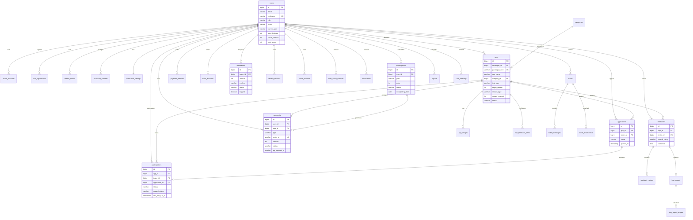

# TestBridge 데이터베이스 설계 (ERD) — Part 2: 관리자/CS + 다이어그램

---

# C. 관리자/CS 엔티티 (9개)

---

## 26. tickets

고객 문의 티켓

```sql
CREATE TABLE tickets (
  id              BIGSERIAL PRIMARY KEY,
  ticket_number   VARCHAR(10) NOT NULL UNIQUE,   -- CS-0001
  user_id         BIGINT NOT NULL REFERENCES users(id),
  inquiry_type    VARCHAR(20) NOT NULL,
  -- BUG, PAYMENT, ACCOUNT, TEST, REWARD, REPORT, FEATURE, OTHER
  title           VARCHAR(100) NOT NULL,
  related_app_id  BIGINT REFERENCES apps(id),
  priority        VARCHAR(10) NOT NULL DEFAULT 'NORMAL',
  -- URGENT, HIGH, NORMAL, LOW
  status          VARCHAR(20) NOT NULL DEFAULT 'SUBMITTED',
  -- SUBMITTED, IN_PROGRESS, ANSWERED, REOPENED, CLOSED
  assigned_to     BIGINT REFERENCES users(id),    -- 담당 관리자
  closed_at       TIMESTAMPTZ,
  created_at      TIMESTAMPTZ NOT NULL DEFAULT NOW(),
  updated_at      TIMESTAMPTZ NOT NULL DEFAULT NOW()
);

CREATE UNIQUE INDEX idx_tickets_number ON tickets(ticket_number);
CREATE INDEX idx_tickets_user_id ON tickets(user_id, created_at DESC);
CREATE INDEX idx_tickets_status ON tickets(status, priority DESC, created_at);
CREATE INDEX idx_tickets_assigned ON tickets(assigned_to, status)
  WHERE assigned_to IS NOT NULL;
CREATE INDEX idx_tickets_unanswered ON tickets(created_at)
  WHERE status IN ('SUBMITTED', 'IN_PROGRESS', 'REOPENED');
```

---

## 27. ticket_messages

문의 대화 메시지 (사용자 질문 + 관리자 답변)

```sql
CREATE TABLE ticket_messages (
  id          BIGSERIAL PRIMARY KEY,
  ticket_id   BIGINT NOT NULL REFERENCES tickets(id) ON DELETE CASCADE,
  sender_id   BIGINT NOT NULL REFERENCES users(id),
  sender_role VARCHAR(10) NOT NULL,      -- USER, ADMIN
  content     TEXT NOT NULL,
  created_at  TIMESTAMPTZ NOT NULL DEFAULT NOW()
);

CREATE INDEX idx_ticket_messages_ticket_id ON ticket_messages(ticket_id, created_at);
```

---

## 28. ticket_attachments

문의 첨부파일

```sql
CREATE TABLE ticket_attachments (
  id          BIGSERIAL PRIMARY KEY,
  ticket_id   BIGINT REFERENCES tickets(id) ON DELETE CASCADE,
  message_id  BIGINT REFERENCES ticket_messages(id) ON DELETE CASCADE,
  file_name   VARCHAR(255) NOT NULL,
  file_url    VARCHAR(500) NOT NULL,
  file_size   INTEGER NOT NULL,           -- bytes
  mime_type   VARCHAR(50) NOT NULL,       -- image/jpeg, application/pdf
  created_at  TIMESTAMPTZ NOT NULL DEFAULT NOW()
);

CREATE INDEX idx_ticket_attachments_ticket ON ticket_attachments(ticket_id);
```

---

## 29. reports

사용자/앱 신고

```sql
CREATE TABLE reports (
  id              BIGSERIAL PRIMARY KEY,
  reporter_id     BIGINT NOT NULL REFERENCES users(id),
  target_type     VARCHAR(10) NOT NULL,      -- USER, APP
  target_user_id  BIGINT REFERENCES users(id),
  target_app_id   BIGINT REFERENCES apps(id),
  reason          VARCHAR(30) NOT NULL,
  -- USER: FAKE_REVIEW, NO_PARTICIPATION, ABUSE, SPAM, OTHER
  -- APP: GAMBLING, ILLEGAL, FRAUD, INAPPROPRIATE, OTHER
  detail          VARCHAR(500),
  status          VARCHAR(20) NOT NULL DEFAULT 'SUBMITTED',
  -- SUBMITTED, IN_REVIEW, WARNING, SUSPENDED, BLOCKED, DISMISSED
  processed_by    BIGINT REFERENCES users(id),
  processed_at    TIMESTAMPTZ,
  process_reason  VARCHAR(500),
  created_at      TIMESTAMPTZ NOT NULL DEFAULT NOW(),
  updated_at      TIMESTAMPTZ NOT NULL DEFAULT NOW()
);

CREATE INDEX idx_reports_target_user ON reports(target_user_id, created_at DESC)
  WHERE target_type = 'USER';
CREATE INDEX idx_reports_target_app ON reports(target_app_id, created_at DESC)
  WHERE target_type = 'APP';
CREATE INDEX idx_reports_status ON reports(status, created_at);
CREATE INDEX idx_reports_reporter ON reports(reporter_id);
```

---

## 30. faqs

FAQ

```sql
CREATE TABLE faqs (
  id          BIGSERIAL PRIMARY KEY,
  category    VARCHAR(20) NOT NULL,       -- TEST, REWARD, PAYMENT, ACCOUNT
  question    TEXT NOT NULL,
  answer      TEXT NOT NULL,
  sort_order  SMALLINT NOT NULL DEFAULT 0,
  is_active   BOOLEAN NOT NULL DEFAULT true,
  created_at  TIMESTAMPTZ NOT NULL DEFAULT NOW(),
  updated_at  TIMESTAMPTZ NOT NULL DEFAULT NOW()
);

CREATE INDEX idx_faqs_category ON faqs(category, sort_order) WHERE is_active = true;
```

---

## 31. notices

공지사항

```sql
CREATE TABLE notices (
  id          BIGSERIAL PRIMARY KEY,
  tag         VARCHAR(20) NOT NULL,        -- IMPORTANT, NOTICE, UPDATE, EVENT
  title       VARCHAR(200) NOT NULL,
  content     TEXT NOT NULL,               -- HTML
  is_pinned   BOOLEAN NOT NULL DEFAULT false,
  author_id   BIGINT NOT NULL REFERENCES users(id),
  published_at TIMESTAMPTZ,
  created_at  TIMESTAMPTZ NOT NULL DEFAULT NOW(),
  updated_at  TIMESTAMPTZ NOT NULL DEFAULT NOW(),
  deleted_at  TIMESTAMPTZ
);

CREATE INDEX idx_notices_published ON notices(is_pinned DESC, published_at DESC)
  WHERE deleted_at IS NULL AND published_at IS NOT NULL;
```

---

## 32. admin_logs

관리자 액션 로그

```sql
CREATE TABLE admin_logs (
  id            BIGSERIAL PRIMARY KEY,
  admin_id      BIGINT NOT NULL REFERENCES users(id),
  action        VARCHAR(50) NOT NULL,
  -- APP_APPROVED, APP_REJECTED, APP_BLOCKED, USER_WARNED, USER_SUSPENDED,
  -- WITHDRAWAL_APPROVED, WITHDRAWAL_REJECTED, REPORT_PROCESSED, etc.
  target_type   VARCHAR(20),              -- USER, APP, WITHDRAWAL, TICKET, REPORT
  target_id     BIGINT,
  detail        JSONB,                    -- 액션 상세 (이전값/이후값)
  ip_address    VARCHAR(45),
  created_at    TIMESTAMPTZ NOT NULL DEFAULT NOW()
);

CREATE INDEX idx_admin_logs_admin_id ON admin_logs(admin_id, created_at DESC);
CREATE INDEX idx_admin_logs_target ON admin_logs(target_type, target_id);
CREATE INDEX idx_admin_logs_action ON admin_logs(action, created_at DESC);
```

---

## 33. user_warnings

사용자 경고 이력

```sql
CREATE TABLE user_warnings (
  id          BIGSERIAL PRIMARY KEY,
  user_id     BIGINT NOT NULL REFERENCES users(id),
  warned_by   BIGINT NOT NULL REFERENCES users(id),  -- 관리자
  reason      VARCHAR(500) NOT NULL,
  report_id   BIGINT REFERENCES reports(id),          -- 관련 신고
  created_at  TIMESTAMPTZ NOT NULL DEFAULT NOW()
);

CREATE INDEX idx_user_warnings_user_id ON user_warnings(user_id, created_at DESC);
```

---

## 34. email_logs

이메일 발송 이력

```sql
CREATE TABLE email_logs (
  id          BIGSERIAL PRIMARY KEY,
  user_id     BIGINT REFERENCES users(id),
  to_email    VARCHAR(255) NOT NULL,       -- 암호화
  type        VARCHAR(30) NOT NULL,
  -- TESTER_SELECTED, TEST_STARTED, DROPOUT, COMPLETED, REWARD,
  -- FEEDBACK, WITHDRAWAL, TICKET_REPLY, WARNING, SYSTEM
  subject     VARCHAR(200) NOT NULL,
  status      VARCHAR(10) NOT NULL DEFAULT 'PENDING',
  -- PENDING, SENT, FAILED
  retry_count SMALLINT NOT NULL DEFAULT 0,
  sent_at     TIMESTAMPTZ,
  failed_at   TIMESTAMPTZ,
  fail_reason VARCHAR(200),
  created_at  TIMESTAMPTZ NOT NULL DEFAULT NOW()
);

CREATE INDEX idx_email_logs_user_id ON email_logs(user_id, created_at DESC);
CREATE INDEX idx_email_logs_status ON email_logs(status)
  WHERE status IN ('PENDING', 'FAILED');
```

---

# D. Mermaid ER 다이어그램



---

# E. 인덱스 전략 요약

## 복합 인덱스

| 테이블 | 인덱스 | 용도 |
|--------|--------|------|
| apps | (status, created_at DESC) | 테스터 앱 목록 (RECRUITING + 최신순) |
| apps | (developer_id, status) | 개발자 내 앱 필터 |
| applications | (app_id, status) | 지원자 상태별 조회 |
| participations | (app_id, status) | 참여자 상태별 조회 |
| participations | (tester_id, status) WHERE ACTIVE | 동시 진행 5개 체크 |
| notifications | (user_id, is_read) WHERE false | 미읽은 알림 뱃지 |
| tickets | (status, priority, created_at) | 미답변 우선순위 정렬 |

## Partial 인덱스

| 테이블 | 조건 | 이유 |
|--------|------|------|
| users | WHERE deleted_at IS NULL | 소프트삭제 제외 |
| apps | WHERE status = 'IN_TESTING' | 스케줄러 종료 체크 |
| withdrawals | WHERE flagged = true | 이상 거래 조회 |
| email_logs | WHERE status IN ('PENDING', 'FAILED') | 재시도 대상 |

---

# F. 스케줄러/배치 대상 테이블

| 스케줄러 | 주기 | 대상 테이블 | 동작 |
|---------|------|-----------|------|
| 테스트 자동 종료 | 매일 00:00 | apps, participations | IN_TESTING + endDate 경과 → COMPLETED |
| 미실행 경고 | 매일 09:00 | participations, notifications | 48시간 미실행 → 경고 알림 |
| 출금 배치 이체 | 영업일 14:00 | withdrawals | PROCESSING → 은행 API |
| 구독 자동 결제 | 매일 06:00 | subscriptions, payments | 결제일 도래 → PG 결제 |
| 알림 자동 삭제 | 매일 03:00 | notifications | 90일↑ 삭제 |
| 탈퇴 영구 삭제 | 매일 04:00 | users (관련 전체) | WITHDRAWN + 30일↑ → 영구 삭제 |
| 앱 등록 한도 리셋 | 매월 1일 00:00 | users | remaining_apps = maxApps(플랜) |
| 티켓 자동 종료 | 매일 02:00 | tickets | ANSWERED + 7일↑ → CLOSED |
| 이메일 재시도 | 매 5분 | email_logs | FAILED + retry < 3 → 재발송 |
| 구독 다운그레이드 | 결제일 | subscriptions, users | pending_plan → plan 적용 |

---

# G. 마이그레이션 순서

의존성 기반 테이블 생성 순서:

```
-- 1차: 독립 테이블 (FK 없음)
CREATE TABLE categories;

-- 2차: users (핵심)
CREATE TABLE users;

-- 3차: users 의존
CREATE TABLE social_accounts;
CREATE TABLE user_agreements;
CREATE TABLE refresh_tokens;
CREATE TABLE nickname_histories;
CREATE TABLE notification_settings;
CREATE TABLE payment_methods;
CREATE TABLE bank_accounts;
CREATE TABLE reward_histories;  -- app_id nullable
CREATE TABLE credit_histories;  -- app_id nullable
CREATE TABLE trust_score_histories;
CREATE TABLE notifications;     -- app_id nullable
CREATE TABLE email_logs;
CREATE TABLE user_warnings;     -- warned_by도 users

-- 4차: users + categories 의존
CREATE TABLE apps;
CREATE TABLE subscriptions;

-- 5차: apps 의존
CREATE TABLE app_images;
CREATE TABLE app_feedback_items;
CREATE TABLE payments;          -- subscription_id nullable

-- 6차: apps + users 의존
CREATE TABLE applications;

-- 7차: applications 의존
CREATE TABLE participations;

-- 8차: participations 의존
CREATE TABLE feedbacks;

-- 9차: feedbacks 의존
CREATE TABLE feedback_ratings;
CREATE TABLE bug_reports;

-- 10차: bug_reports 의존
CREATE TABLE bug_report_images;

-- 11차: users + bank_accounts 의존
CREATE TABLE withdrawals;

-- 12차: users + apps 의존
CREATE TABLE tickets;
CREATE TABLE reports;

-- 13차: tickets 의존
CREATE TABLE ticket_messages;
CREATE TABLE ticket_attachments;

-- 14차: 관리자
CREATE TABLE admin_logs;
CREATE TABLE faqs;
CREATE TABLE notices;
```

---

# H. 초기 시드 데이터

```sql
-- 카테고리 14개
INSERT INTO categories (name, icon, sort_order) VALUES
  ('게임', '🎮', 1), ('유틸리티', '🔧', 2), ('소셜/커뮤니케이션', '💬', 3),
  ('건강/피트니스', '🏃', 4), ('교육', '📚', 5), ('금융', '💰', 6),
  ('라이프스타일', '🏠', 7), ('사진/동영상', '📷', 8), ('음악/오디오', '🎵', 9),
  ('생산성', '📋', 10), ('여행/지역', '✈️', 11), ('쇼핑', '🛒', 12),
  ('뉴스/매거진', '📰', 13), ('기타', '📱', 14);

-- 관리자 계정 (Google OAuth 가입 후 수동 role 변경)
-- UPDATE users SET role = 'ADMIN' WHERE email_hash = '{admin_email_hash}';
```

---

# I. 테이블 통계

| 구분 | 테이블 수 | 비고 |
|------|----------|------|
| 핵심 | 8 | users, apps, applications, participations, feedbacks, payments, subscriptions, withdrawals |
| 보조 | 17 | 소셜, 약관, 토큰, 이미지, 히스토리 등 |
| 관리자/CS | 9 | 티켓, 신고, FAQ, 공지, 로그 등 |
| **합계** | **34** | |

| 항목 | 수 |
|------|---|
| 유니크 제약 | 12 |
| FK 제약 | 42 |
| 인덱스 (일반) | 38 |
| Partial 인덱스 | 8 |
| CHECK 제약 | 2 |
